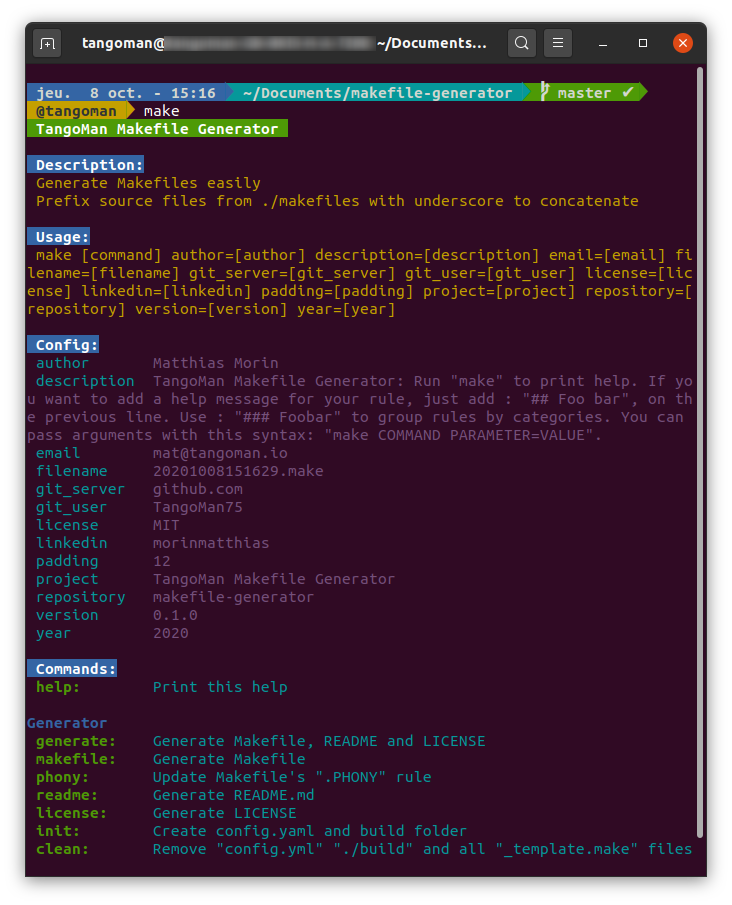

[](https://github.com/TangoMan75/makefile-generator/releases)
[]((https://github.com/TangoMan75/makefile-generator/blob/master/LICENSE))
[](https://github.com/TangoMan75/makefile-generator/stargazers)
[](https://github.com/TangoMan75/makefile-generator/actions/workflows/make.yml)


TangoMan Makefile Generator
===========================

Awesome **TangoMan Makefile Generator** is a fast and handy tool to generate self documenting makefiles and provides neat makefiles templates.



🎯 Features
-----------

**TangoMan Makefile Generator** generates Makefile, README.md, LICENSE (Apache, MIT, GPL2, GPL3) from templates with one single command.

Template values are configurable with `config.yaml`.

**TangoMan Makefile Generator** will generate `.PHONY` rule, and detailed help from available rules and parameters for your makefile.

### 💡 Self documentation

Generated Makefiles will print self documentation, with the `help` command and Awk.

If you want to add a help message for your rule, just add : `## Foo bar`, on the previous line.

Use : `### Foobar` to group rules by categories.

💻 Dependencies
---------------

**TangoMan Makefile Generator** requires the following dependencies:

- Make
- GAWK
- SED

which should be available by default on most linux distributions.

---

### 🛠 Gawk

#### 🐧 Install Gawk (Linux)

On linux machine enter following command

```bash
$ sudo apt-get install --assume-yes gawk
```

#### 🏁 Install Gawk (Windows)

On windows machine you will need to install [cygwin](http://www.cygwin.com/) or Gawk for Windows](http://gnuwin32.sourceforge.net/packages/gawk.htm) first to execute script.

#### 🍎 Install Gawk (OSX)

Gawk should be available by default on OSX system, but you can upgrade Gawk version with following command

```bash
$ brew install gawk
```

---

### 🛠 Make

#### 🐧 Install Make (Linux)

On linux machine enter following command

```bash
$ sudo apt-get install --assume-yes make
```

#### 🏁 Install Make (Windows)

On windows machine you will need to install [cygwin](http://www.cygwin.com/) or [GnuWin make](http://gnuwin32.sourceforge.net/packages/make.htm) first to execute make script.

#### 🍎 Install Make (OS X)

Make exists by default on OS X, if you want to update to a newer version use:

```bash
$ brew install make
```

---

### 🛠 Sed

#### 🐧 Install Sed (Linux)

On linux machine enter following command

```bash
$ sudo apt-get install --assume-yes sed
```

#### 🏁 Install Sed (Windows)

On windows machine you will need to install [cygwin](http://www.cygwin.com/) or [Sed for Windows](http://gnuwin32.sourceforge.net/packages/sed.htm) first to execute script.

#### 🍎 Install Sed (OSX)

Sed should be available by default on OSX system, but you can upgrade Sed version with following command

```bash
$ brew install sed
```

---

🔥 Usage
--------

Prefix template files with underscore in the `makefiles`, `vars` and `header` directories to be concatenated.

Tags delimited with double curly braces (eg: `{{ PLACEHODER }}`) will be replaced with values from `config.yaml` file.

Valid tags are:

- `{{ FILENAME }}`:    Filename of generated Makefile (default is current datetime, eg: 20210101090000.make).
- `{{ PROJECT }}`:     Project name.
- `{{ VERSION }}`:     Project version number.
- `{{ DESCRIPTION }}`: Project description.
- `{{ PADDING }}`:     Padding spaces in the `help` command.
- `{{ AUTHOR }}`:      Project author.
- `{{ EMAIL }}`:       Author email.
- `{{ YEAR }}`:        License year.
- `{{ LICENSE }}`:     License type (valid types: mit, apache, gpl2, gpl3).
- `{{ GIT_SERVER }}`:  Project repository server.
- `{{ GIT_USER }}`:    Project repository username.
- `{{ REPOSITORY }}`:  Project repository name.

### 📝 Note 1

`{{ PHONY }}` and `{{ MARKDOWN }}` values are generated on the fly and are not configurable.

- `{{ PHONY }}`:    Generated `.PHONY:` rule.
- `{{ MARKDOWN }}`: Generated markdown documentation.

### 📝 Note 2

Do not use **backticks** inside `{{ DESCRIPTION }}` block, help rules or categories..

### ✅ Parameters

Run `make` to print help

```bash
$ make [command] author=[author] description=[description] email=[email] filename=[filename] git_server=[git_server] git_user=[git_user] license=[license] padding=[padding] project=[project] repository=[repository] version=[version] year=[year] 
```

Available commands are: `help generate makefile phony readme license changelog code contrib ci-cd init clean `

🤖 Commands
-----------

#### ⚡ Print this help
```bash
$ make help
```

### Generator
#### ⚡ Generate all
```bash
$ make generate
```

#### ⚡ Generate Makefile
```bash
$ make makefile
```

#### ⚡ Update .PHONY: rule
```bash
$ make phony
```

#### ⚡ Generate README.md
```bash
$ make readme
```

#### ⚡ Generate LICENSE
```bash
$ make license
```

#### ⚡ Generate CHANGELOG.md
```bash
$ make changelog
```

#### ⚡ Generate CODE_OF_CONDUCT.md
```bash
$ make code
```

#### ⚡ Generate CONTRIBUTING.md
```bash
$ make contrib
```

#### ⚡ Copy CI-CD tools
```bash
$ make ci-cd
```

#### ⚡ Create config.yaml and .-build folder
```bash
$ make init
```

#### ⚡ Remove config.yml .-build and all \_template.make files
```bash
$ make clean
```

📝 Notes
--------

You can find emojis for semantic enhancement here:

- [gist.github.com/parmentf](https://gist.github.com/parmentf/035de27d6ed1dce0b36a)
- [webfx.com/tools/emoji-cheat-sheet](https://www.webfx.com/tools/emoji-cheat-sheet)

🤝 Contributing
---------------

Thank you for your interest in contributing to **TangoMan Makefile Generator**.

Please review the [code of conduct](./CODE_OF_CONDUCT.md) and [contribution guidelines](./CONTRIBUTING.md) before starting to work on any features.

If you want to open an issue, please check first if it was not [reported already](https://github.com/TangoMan75/makefile-generator/issues/) before creating a new one.

📜 License
----------

Copyrights (c) 2021 &quot;Matthias Morin&quot; &lt;mat@tangoman.io&gt;

[](LICENSE)
Distributed under the MIT license.

If you like **TangoMan Makefile Generator** please star, follow or tweet about it:

[](https://github.com/TangoMan75/makefile-generator/stargazers)
[](https://github.com/TangoMan75)
[](https://twitter.com/intent/tweet?text=Wow:&url=https%3A%2F%2Fgithub.com%2FTangoMan75%2Fmakefile-generator)

... And check my other cool projects.
